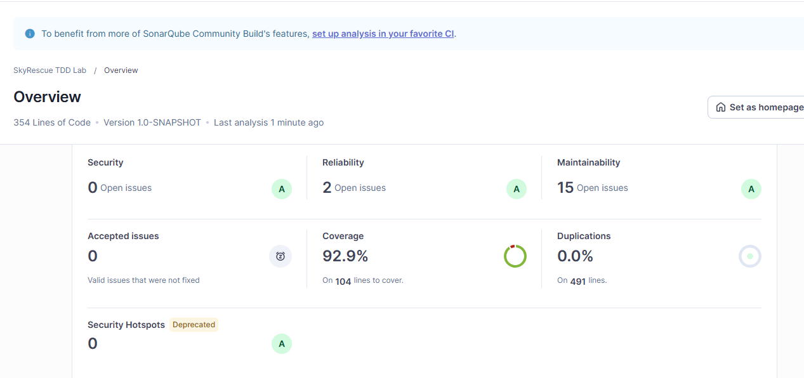
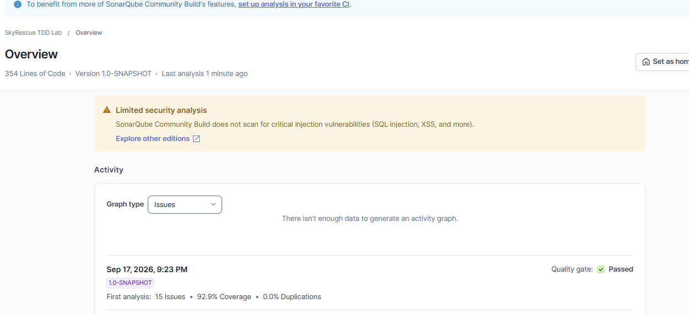

## Integrantes

* Daniel Felipe Sua

* David Felipe Ortiz

* Juan Pablo Duarte

## Descripción de SkyRescue

SkyRescue es una plataforma que coordna drones de emergencia: registra drones y operadores, asigna misiones hacia zonas de dificil acceso y las cierra cuando el dron regresa. Las reglas son: un dron no puede asignarse si ya está en otra mision activa o si la distancia excede su autonoma; un operador no puede tener dos misiones activas al mismo tiempo ni asignarse a una misión que no existe; y una misión no puede cerrarse dos veces. Con TDD se desarrollaron tres operaciones: addDrone, assignMssion ycompleteMission

## Evidencia TDD - Daniel Felipe

### A. Registro de drones (addDrone)

#### Ciclo TDD - registrar un dron válido

**RED:**

**GREEN:** 

### B. Asignación de misiones (assignMission)

#### Ciclo TDD - operador inexistente

**RED:** 

**GREEN:** 

#### Ciclo TDD - operador con otra misión activa

**RED:** 

**GREEN:** 

### C. Cierre de misiones (completeMission)

#### Ciclo TDD - completar una misión activa

**RED:** 

**GREEN:** 

#### Ciclo TDD - completar una misión inexistente

**RED:** 

**GREEN:** 

## Evidencia TDD - Juan Pablo Duarte

### A. Registro de drones (addDrone)

#### Ciclo TDD - dron con id compuesto solo por espacios en blanco

**RED:** 

**GREEN:** 

**REFACTOR:** se extrajo la validación a un metodo privado reutilizable isValidId, luego reutilizado también en completeMission

### C. Cierre de misiones (completeMission)

#### Ciclo TDD - id de misión nulo o en blanco

**RED:** 

**GREEN:** 

**REFACTOR:** se normaliz la indentacion inconsistente de todo RescueCenter.java

## Cobertura 

## Análisis SonarQube

### Analisis inicial SonarQube
**Quality Gate:**  Passed
**Coverage Jacoco:** 85.58% (89/104 líneas)
**Coverage sonar:** 84.3%
**Duplicación:** 0.0%
**Issues:** 0 Security, 2 Reliability, 13 Maintainability

### Análisis final SonarQube
**Quality Gate:** Passed
**Coverage JaCoCo:** ~93% (97/104 líneas)
**Coverage Sonar:** 92.9% (104 líneas a cubrir)
**Duplicación:** 0.0% (sobre 491 líneas)
**Issues:** 0 Security, 2 Reliability, 15 Maintainability

Tras completar las pruebas faltantes de `Drone` (equals, hashCode y getModel), la cobertura subió de 84.3% a 92.9% en Sonar, y de 85.58% a ~93% en JaCoCo. El Quality Gate se mantuvo en Passed.

## Pull Requests

- PR JUnit: [#1](https://github.com/DANFELcode/DOSW_Lab5_Sua_Ortiz_Duarte/pull/1)
- PR clases base: [#2](https://github.com/DANFELcode/DOSW_Lab5_Sua_Ortiz_Duarte/pull/2)
- PR TDD addDrone: [#3](https://github.com/DANFELcode/DOSW_Lab5_Sua_Ortiz_Duarte/pull/3), [#6](https://github.com/DANFELcode/DOSW_Lab5_Sua_Ortiz_Duarte/pull/6), [#7](https://github.com/DANFELcode/DOSW_Lab5_Sua_Ortiz_Duarte/pull/7), [#12](https://github.com/DANFELcode/DOSW_Lab5_Sua_Ortiz_Duarte/pull/12)
- PR TDD assignMission: [#8](https://github.com/DANFELcode/DOSW_Lab5_Sua_Ortiz_Duarte/pull/8), [#9](https://github.com/DANFELcode/DOSW_Lab5_Sua_Ortiz_Duarte/pull/9), [#11](https://github.com/DANFELcode/DOSW_Lab5_Sua_Ortiz_Duarte/pull/11), [#16](https://github.com/DANFELcode/DOSW_Lab5_Sua_Ortiz_Duarte/pull/16)
- PR TDD completeMission: [#10](https://github.com/DANFELcode/DOSW_Lab5_Sua_Ortiz_Duarte/pull/10), [#13](https://github.com/DANFELcode/DOSW_Lab5_Sua_Ortiz_Duarte/pull/13)
- PR JaCoCo: [#14](https://github.com/DANFELcode/DOSW_Lab5_Sua_Ortiz_Duarte/pull/14), [#19](https://github.com/DANFELcode/DOSW_Lab5_Sua_Ortiz_Duarte/pull/19)
- PR SonarQube: [#17](https://github.com/DANFELcode/DOSW_Lab5_Sua_Ortiz_Duarte/pull/17), [#18](https://github.com/DANFELcode/DOSW_Lab5_Sua_Ortiz_Duarte/pull/17)

## Reflexión técnica

1. **¿Qué error o comportamiento inesperado fue detectado primero gracias a una prueba?**
   En addDrone, el uso de isEmpty() no detectaba ids compuestos solo por espacios en blanco, permitiendo registrar drones con un id que no se puede. Se descubrió al escribir un test que esperaba que ese registro fallara y en lugar de eso pasaba

2. **¿Qué parte del código cambió durante REFACTOR sin modificar el comportamiento?**
   Se extrajo la validación de id a un método privado que se podia volver a usar isValidId, usar en addDrone y en completeMission, y se normalizó la indentacion inconsistente de RescueCenter.java

3. **¿Qué casos adicionales aparecieron al revisar la cobertura?**
   El reporte de JaCoCo mostro que Drone.java tenia equals(), hashCode() y el getter getModel() sin ninguna prueba, lo que hizo que tubieramos queagregar 6 casos mas en DroneTest

