## Integrantes

* Daniel Felipe Sua

* David Felipe Ortiz

* Juan Pablo Duarte

## Descripción de SkyRescue

SkyRescue es una plataforma que coordina drones de emergencia: registra drones y operadores, asigna misiones hacia zonas de difícil acceso y las cierra cuando el dron regresa. Las reglas principales del dominio son: un dron no puede asignarse si ya está en otra misión activa o si la distancia excede su autonomía; un operador no puede tener dos misiones activas al mismo tiempo ni asignarse a una misión inexistente; y una misión no puede cerrarse dos veces. Con TDD se desarrollaron tres operaciones del dominio: registrar un dron (`addDrone`), asignar una misión (`assignMission`) y completar una misión (`completeMission`).

## Evidencia TDD - Daniel Felipe

### A. Registro de drones (addDrone)

#### Ciclo TDD - registrar un dron válido

**RED:**

**GREEN:** 

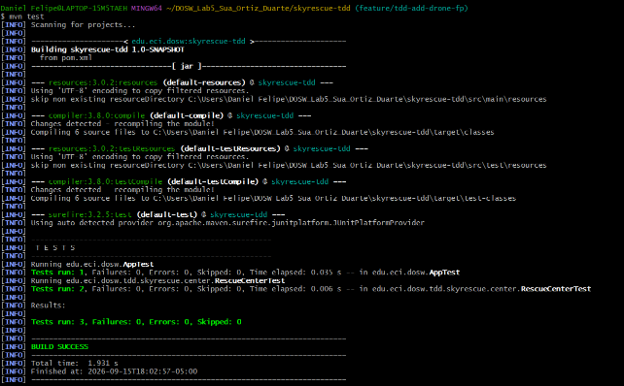

### B. Asignación de misiones (assignMission)

#### Ciclo TDD - operador inexistente

**RED:** 

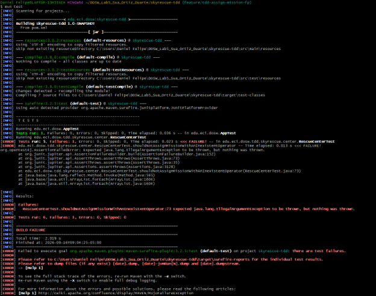

**GREEN:** 

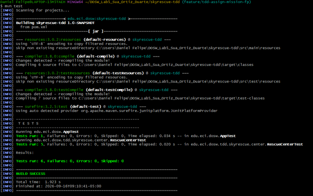

#### Ciclo TDD - operador con otra misión activa

**RED:** 

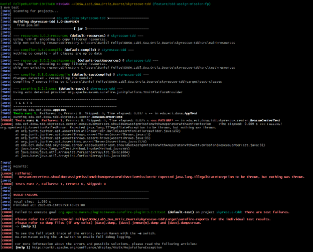

**GREEN:** 

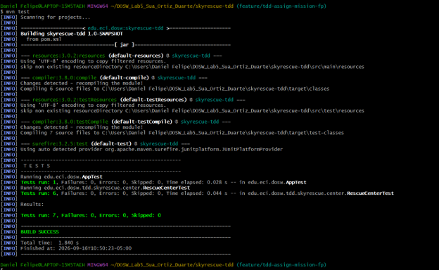

### C. Cierre de misiones (completeMission)

#### Ciclo TDD - completar una misión activa

**RED:** 

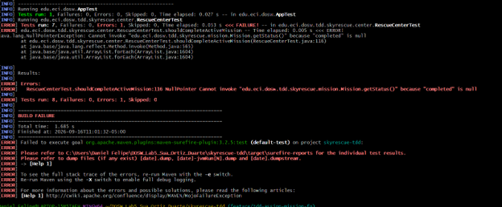

**GREEN:** 

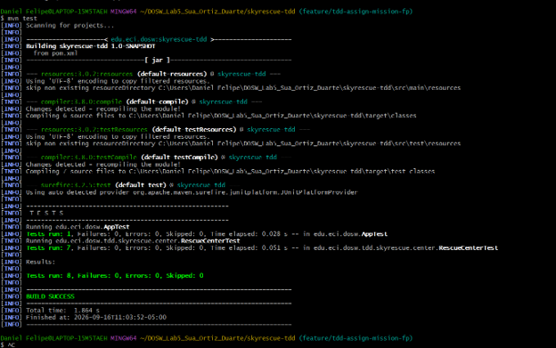

#### Ciclo TDD - completar una misión inexistente

**RED:** 

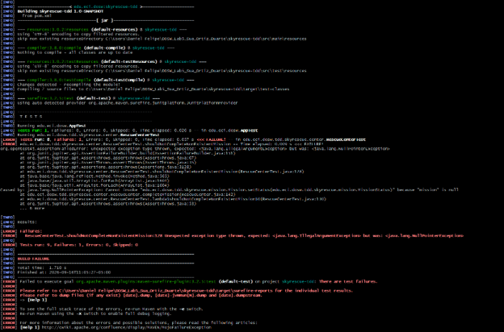

**GREEN:** 

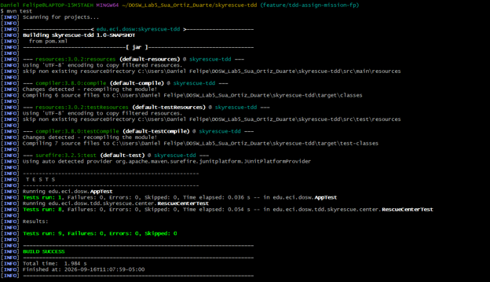

## Evidencia TDD - Juan Pablo Duarte

### A. Registro de drones (addDrone)

#### Ciclo TDD - dron con id compuesto solo por espacios en blanco

**RED:** `isEmpty()` no detectaba un id de solo espacios (`"   "`), permitiendo registrar un dron inválido.

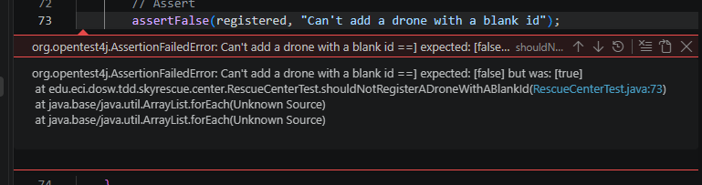

**GREEN:** se cambió `isEmpty()` por `isBlank()` en `addDrone`.

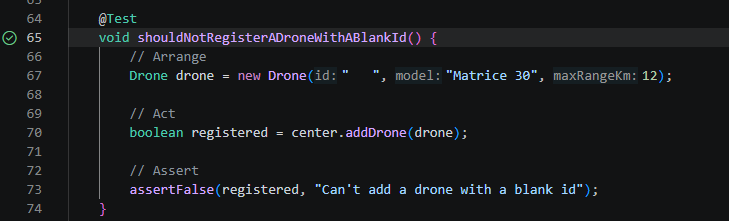

**REFACTOR:** se extrajo la validación a un método privado reutilizable `isValidId`, luego reutilizado también en `completeMission`.

### C. Cierre de misiones (completeMission)

#### Ciclo TDD - id de misión nulo o en blanco

**RED:** `completeMission` no validaba explícitamente un `missionId` en blanco, cayendo en el mensaje genérico de "misión no encontrada" en vez de un mensaje de validación claro.

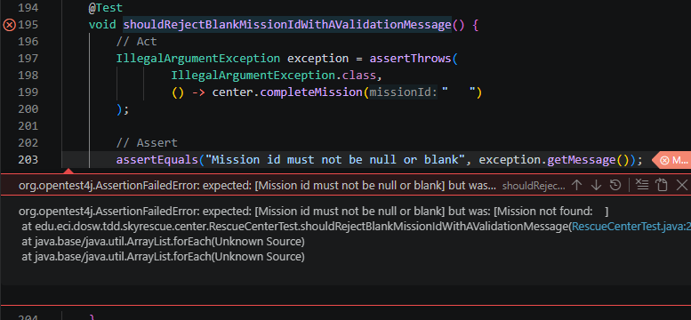

**GREEN:** se agregó una validación temprana reutilizando `isValidId`, que lanza `IllegalArgumentException("Mission id must not be null or blank")`.

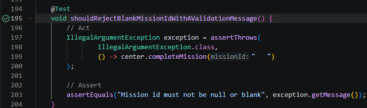

**REFACTOR:** se normalizó la indentación inconsistente de todo `RescueCenter.java`.

## Cobertura 

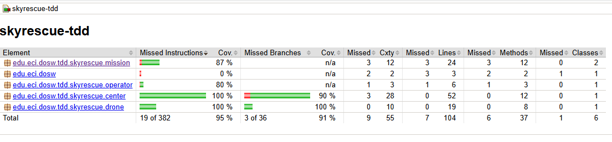

## Análisis SonarQube

### Analisis inicial SonarQube
**Quality Gate:**  Passed
**Coverage Jacoco:** 85.58% (89/104 líneas)
**Coverage sonar:** 84.3%
**Duplicación:** 0.0%
**Issues:** 0 Security, 2 Reliability, 13 Maintainability

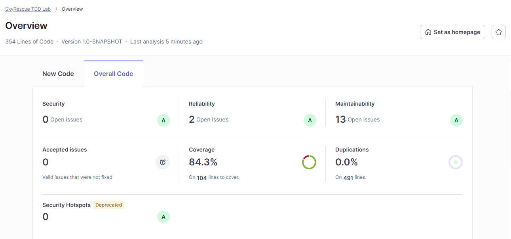

## Pull Requests

- PR JUnit: #1
- PR clases base: #2
- PR TDD addDrone: #3, #6, #7, #12
- PR TDD assignMission: #8, #9, #11, #16
- PR TDD completeMission: #10, #13
- PR JaCoCo: #14, #19
- PR SonarQube: #17, #18

## Reflexión técnica

1. **¿Qué error o comportamiento inesperado fue detectado primero gracias a una prueba?**
   En `addDrone`, el uso de `isEmpty()` no detectaba ids compuestos solo por espacios en blanco (ej. `"   "`), permitiendo registrar drones con un id inválido. Se descubrió al escribir un test que esperaba que ese registro fallara y en cambio pasaba.

2. **¿Qué parte del código cambió durante REFACTOR sin modificar el comportamiento?**
   Se extrajo la validación de id (nulo o en blanco) a un método privado reutilizable `isValidId`, usado tanto en `addDrone` como en `completeMission`, y se normalizó la indentación inconsistente de `RescueCenter.java`.

3. **¿Qué casos adicionales aparecieron al revisar la cobertura?**
   El reporte de JaCoCo mostró que `Drone.java` tenía `equals()`, `hashCode()` y el getter `getModel()` sin ninguna prueba (47% de cobertura), lo que llevó a agregar 6 casos nuevos en `DroneTest`.

