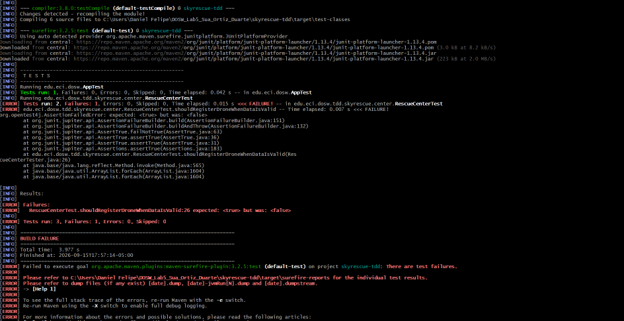

## Integrantes

Daniel Felipe Sua
David Felipe Ortiz
Juan Pablo Duarte

## Evidencia TDD - Daniel Felipe

### A. Registro de drones (addDrone)

#### Ciclo TDD - registrar un dron válido
**RED:** 

**GREEN:** 

### B. Asignación de misiones (assignMission)

#### Ciclo TDD - operador inexistente
**RED:** 

**GREEN:** 

#### Ciclo TDD - operador con otra misión activa
**RED:** 

**GREEN:** 

### C. Cierre de misiones (completeMission)

#### Ciclo TDD - completar una misión activa
**RED:** 

**GREEN:** 

#### Ciclo TDD - completar una misión inexistente
**RED:** 

**GREEN:** 

